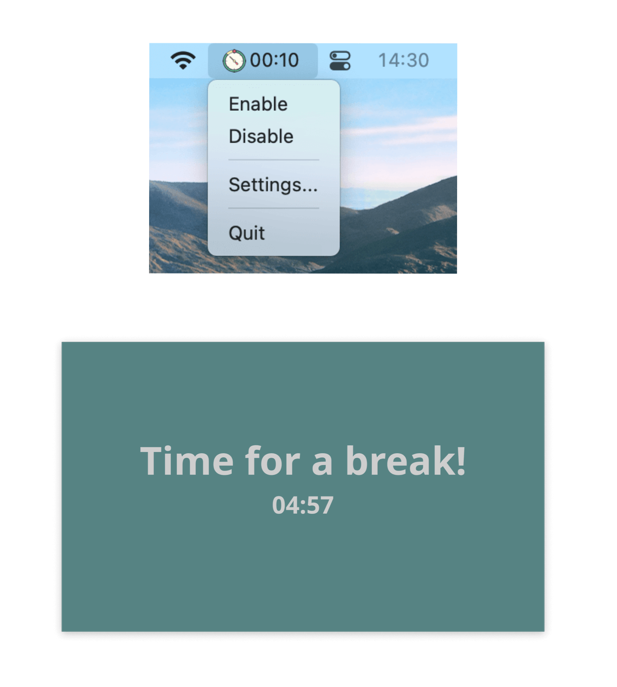

# Work Break Timer

A simple cross-platform GUI app to remind you to take breaks when working on your computer. Using Go & Fyne.

This app is designed to remind you to take breaks when working for long periods. Working too much is bad for our health and work efficiency.

By following the Pomodoro timer, you can work for 25 minutes and then enjoy a 5-minute break.


## Screenshots




## Compiling for different platforms

```
go install github.com/fyne-io/fyne-cross@latest

fyne-cross windows -arch=*
fyne-cross darwin -arch=*
```